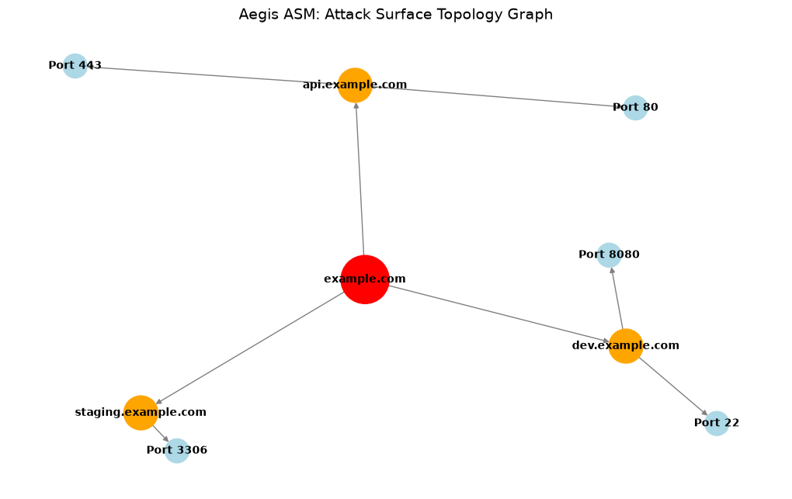
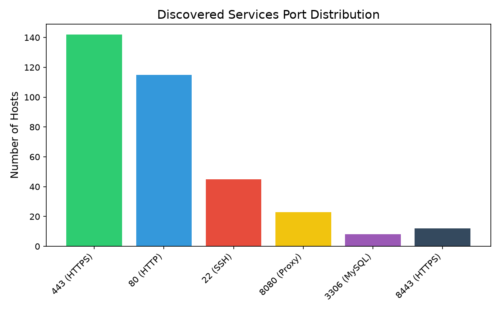
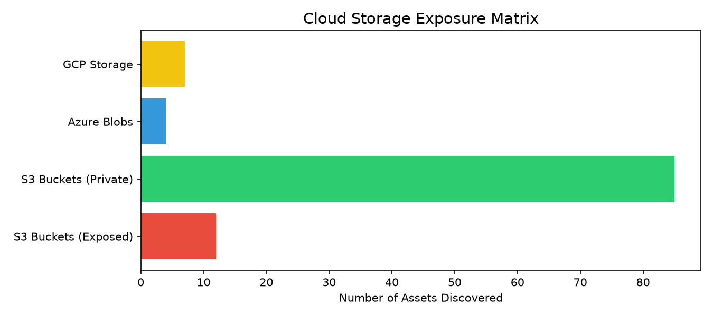
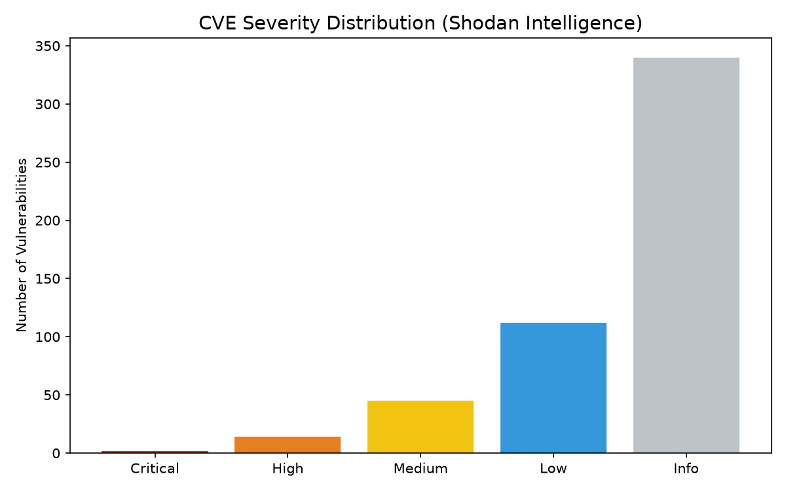
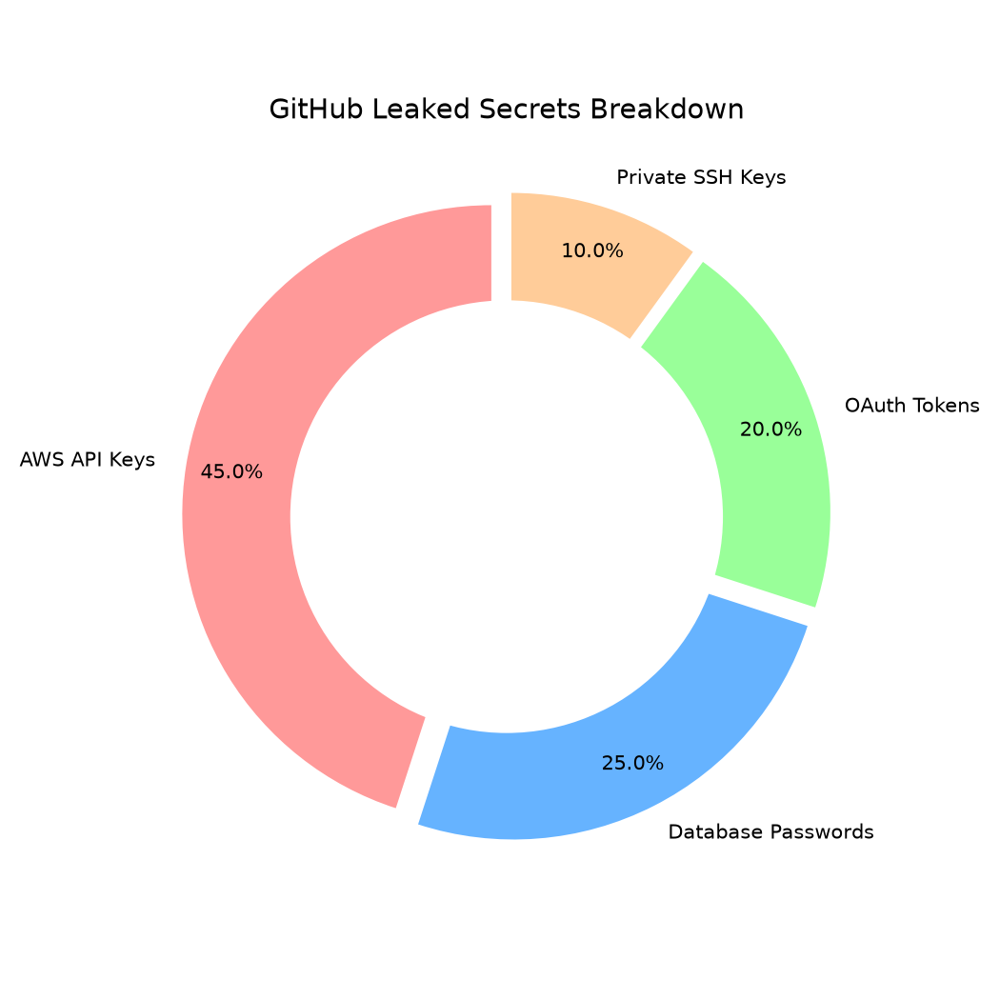

# Aegis: Automated Attack Surface Mapper & OSINT Engine


Aegis is an enterprise-grade, **Highly Concurrent Attack Surface Mapping (ASM)** and Open-Source Intelligence (OSINT) CLI engine. Designed for Red Teamers, Bug Bounty Hunters, and Cloud Security Engineers, Aegis dynamically maps external attack surfaces, bypasses traditional WAFs using passive OSINT, and integrates seamlessly into Security Information and Event Management (SIEM) systems.

---

## 🚀 V2 Core Capabilities

Aegis goes beyond standard recon tools by integrating DevSecOps pipelines and Cloud-native vulnerability detection.

1. **Cloud Storage Hunters (AWS S3):** Actively brute-forces S3 bucket naming permutations (`-dev`, `-staging`) to discover publicly exposed corporate data.
2. **Wayback Machine Integration:** Scrapes the Internet Archive to map "shadow IT" and forgotten API endpoints.
3. **WAF Fingerprinting:** Dynamically detects Web Application Firewalls (Cloudflare, AWS WAF, Akamai) via HTTP header analysis.
4. **Passive Subdomain Enumeration (`crt.sh`)**: Queries Certificate Transparency logs to discover subdomains silently without triggering IDS.
5. **Active Reconnaissance (`nmap`)**: Performs deep service, port, and OS version detection.
6. **Leaked Secret Hunting (`GitHub API`)**: Scans public repositories for hardcoded AWS keys and `.env` files.

---

## 🧠 Data Flow Architecture

Aegis orchestrates telemetry streams concurrently via Python's `ThreadPoolExecutor`, normalizing data into a JSON schema for downstream SIEM ingestion.

```mermaid
graph LR
    A[Target Domain] --> B(crt.sh Logs)
    A --> C(Nmap Scanner)
    A --> D(Shodan API)
    A --> E(GitHub REST API)
    A --> I(AWS S3 Buckets)
    A --> J(Wayback Machine)
    A --> K(WAF Fingerprinter)
    
    B --> F{Aegis OSINT Engine}
    C --> F
    D --> F
    E --> F
    I --> F
    J --> F
    K --> F
    
    F -->|Telemetry Aggregation| G[(Structured JSON Artifact)]
    G -->|Ingestion| H[Enterprise SIEM / SOC]
    
    style F fill:#1e1e1e,stroke:#00ffcc,stroke-width:2px
    style G fill:#2c3e50,stroke:#fff
    style H fill:#8b0000,stroke:#fff
```



## 📊 Telemetry Visualizations & Analytics

Aegis aggregates massive amounts of OSINT data and structures it for analytical visualization. Below are real examples of the data matrices produced by the engine during a target sweep, generated natively via Python's `matplotlib` and `networkx`:

### 1. External Attack Surface Topology
Visualizing the relationship between discovered subdomains and open ports dynamically mapped by the `nmap` active scanning module.


### 2. Network Service & Port Distribution
A histogram mapping the frequency of exposed services across the target's entire ASN.


### 3. Cloud Storage Exposure Matrix
Categorization of discovered cloud storage endpoints (AWS S3, Azure) based on access controls, highlighting critically exposed buckets.


### 4. Historical Vulnerability Distribution (CVEs)
Aggregated threat intelligence pulled from the Shodan API, classifying transient and historical vulnerabilities by CVSS severity.


### 5. Codebase Secret Leaks
A proportional breakdown of hardcoded secrets, API tokens, and passwords scraped from public GitHub repositories associated with the target domain.


---

## 🛠️ Codebase Structure

Aegis enforces a strict, modular software engineering architecture.

```text
attack-surface-mapper/
├── asm.py                  # Main Orchestrator (concurrent.futures)
├── Dockerfile              # Alpine containerization
├── .github/workflows/      # Automated CI/CD Actions pipeline
└── modules/
    ├── __init__.py
    ├── cloud_storage.py    # AWS S3 Bucket brute-forcer
    ├── wayback.py          # Internet Archive scraper
    ├── waf_detector.py     # HTTP Header fingerprinting
    ├── subdomains.py       # crt.sh parsing
    ├── ports.py            # Nmap XML parsing
    ├── shodan_lookup.py    # Shodan API handling
    ├── github_leaks.py     # GitHub Secrets API pagination
    └── report.py           # JSON serialization
```

---

## ⚙️ Setup & Installation

You can run Aegis directly via Python or as an isolated Docker container.

### Option A: Docker (Recommended)
```bash
git clone https://github.com/saif4224/attack-surface-mapper.git
cd attack-surface-mapper
docker build -t aegis-asm .
docker run --rm aegis-asm -d example.com
```

### Option B: Python Virtual Environment
*Note: You must have the `nmap` binary installed on your host system.*
```bash
python -m venv .venv && source .venv/bin/activate
pip install -r requirements.txt
python asm.py -d example.com
```

---

## 🔄 CI/CD & Automated Monitoring

Aegis is built for Continuous Monitoring (DevSecOps). The repository includes a pre-configured **GitHub Actions pipeline** (`asm-scan.yml`).

By default, the pipeline runs every Saturday at 2:00 AM, automatically scanning your defined target and uploading the generated `report.json` as a build artifact for review.

---

## 💻 Example Terminal Execution

```text
    █████╗ ███████╗ ██████╗ ██╗███████╗
    ██╔══██╗██╔════╝██╔════╝ ██║██╔════╝
    ███████║█████╗  ██║  ███╗██║███████╗
    ██╔══██║██╔══╝  ██║   ██║██║╚════██║
    ██║  ██║███████╗╚██████╔╝██║███████║
    ╚═╝  ╚═╝╚══════╝ ╚═════╝ ╚═╝╚══════╝
    Attack Surface Mapper & OSINT Engine v2.0

[+] Initiating Attack Surface Mapping for: example.com

[+] WAF Status: Cloudflare
[+] Discovered 42 subdomains.
[+] Launching Asynchronous Scanning Engine (Threads: 5)...
  ➔ Active port scan complete.
  ➔ Cloud storage check complete. Checked AWS S3 permutations.
  ➔ Wayback Machine mining complete. Found 20 endpoints.
  ➔ Shodan lookup complete.
  ➔ GitHub scraping complete.

[✓] Attack Surface Mapping Complete!
Report saved to: results.json
```

## ⚠️ Disclaimer
This tool is built for educational, authorized penetration testing, and defensive attack surface mapping only. Ensure you have explicit permission before scanning targets.

## 📜 License
MIT — see [LICENSE](LICENSE).
